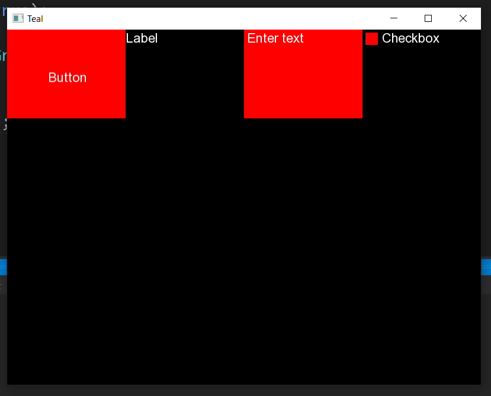

# Teal
Playground for hobby project : C++ SFML based GUI library.


### Snippet

Inline-style: 



### Basic Demo (found in main.cpp)

```
void buttonClick() {
	std::cout << "Hello from the button" << std::endl;
}

int main() {
	Application* app = new Application();

	Button button = Button();
	button.setPosition(200, 30);
	app->bind(button, EventTypes::ON_CLICK, buttonClick);

	Label label = Label();
	label.setPosition(300, 300);

	TextInput textInput = TextInput();
	textInput.setPosition(400, 400);

	Checkbox checkbox = Checkbox();
	checkbox.setChecked(true);

	GridLayout layout = GridLayout();
	layout.add(button);
	layout.add(label);
	layout.add(textInput);
	layout.add(checkbox);
	layout.freeze();

	app->add(layout);
	app->run();


	// ----- Cleanup -----
	delete app;

	return 0;
}
```
